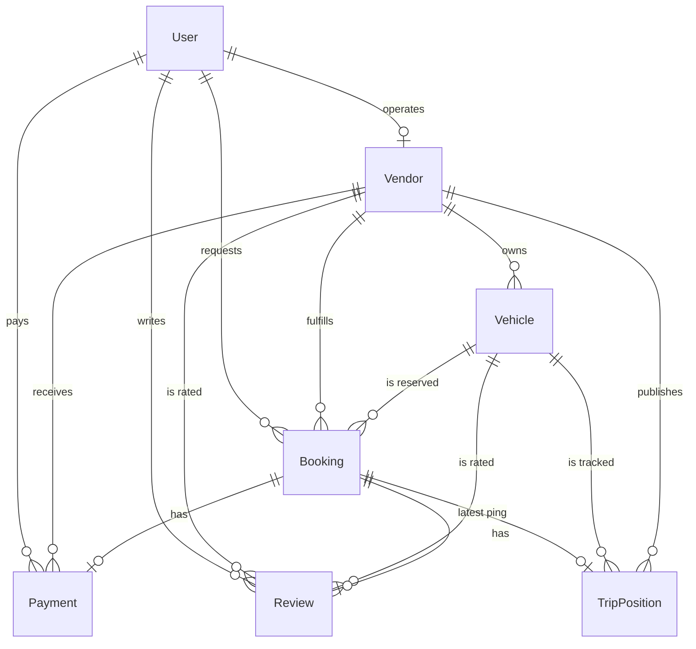

# Wayfleet database design

Milestone 3 defined the MongoDB Atlas foundation. Milestone 4 adds authentication fields on `users`. Milestone 6 stores and serves the public vehicle catalog from `vehicles`. Milestone 7 writes the booking lifecycle to `bookings`. Milestone 8 stores Razorpay orders and verification results on `payments`. Milestone 9 stores GeoJSON Points on vehicle and booking locations. Milestone 10 stores the latest trip GPS ping in `trip_positions`.

## Collections

| Collection | Model | Purpose |
| --- | --- | --- |
| `users` | User | People on the platform. Email/password hash and optional Google subject for Auth.js. |
| `vendors` | Vendor | Fleet operators. One vendor profile per user in this foundation. |
| `vehicles` | Vehicle | Bookable assets owned by a vendor. Marketplace APIs read and write this collection. |
| `bookings` | Booking | A customer request against one vehicle, including time window, agreed amount, snapshot, and status. |
| `payments` | Payment | One Razorpay-backed payment record per booking. Amount comes from the booking. |
| `reviews` | Review | One review per completed booking (enforced later in APIs). |
| `trip_positions` | TripPosition | Latest live GPS for one booking. Not a route history. TTL 24 hours. |

Every document has MongoDB `_id` and Mongoose `createdAt` / `updatedAt` timestamps.

## Relationships

References are `ObjectId` fields, not embedded copies of the related document:

- `Vendor.user` → `User`
- `Vehicle.vendor` → `Vendor`
- `Booking.customer` → `User`
- `Booking.vendor` → `Vendor`
- `Booking.vehicle` → `Vehicle`
- `Payment.booking` → `Booking` (unique)
- `Payment.customer` → `User`
- `Payment.vendor` → `Vendor`
- `Review.booking` → `Booking` (unique)
- `Review.customer` → `User`
- `Review.vendor` → `Vendor`
- `Review.vehicle` → `Vehicle`
- `TripPosition.booking` → `Booking` (unique, latest ping only)
- `TripPosition.vehicle` → `Vehicle`
- `TripPosition.vendor` → `Vendor`

## Money and location

Amounts are **integer minor units** plus an ISO 4217 currency code (default `INR`). Example: ₹1,250.00 is stored as `125000` paise.

Location subdocuments store a human-readable `label`, optional `city` / `state` / `country`, optional `lat` / `lng`, and optional GeoJSON `point` (`{ type: "Point", coordinates: [longitude, latitude] }`). Existing documents without `point` remain valid. See `docs/MAPS_AND_GEOSPATIAL.md`.

Vehicle documents also store `description`, `images` (URL strings), denormalized `rating.average` / `rating.count` (for catalog sort/filter; reviews APIs are not implemented), `availability`, and `status` (`draft` | `active` | `inactive` | `blocked`). Marketplace creates listings as `active`. `DELETE` sets `inactive`.

## Important indexes

| Collection | Index | Why |
| --- | --- | --- |
| `users` | unique `email` | Login identity |
| `users` | `{ role, status }` | Admin filters |
| `users` | sparse unique `googleSubject` | Google account link |
| `vendors` | unique `user` | One vendor profile per user |
| `vendors` | `{ verificationStatus, kycStatus }` | Onboarding queues |
| `vehicles` | unique `registrationNumber` | Legal identity of the asset |
| `vehicles` | `{ category, status, availability }` | Catalog filters |
| `vehicles` | `{ location.city, status }` | City search |
| `vehicles` | `2dsphere` on `location.point` | Nearby vehicle search |
| `vehicles` | `{ brand, model, status }` | Brand/model search |
| `vehicles` | `{ pricing.amount, status }` | Price filter and sort |
| `vehicles` | `{ rating.average, status }` | Rating filter and sort |
| `bookings` | `{ customer, createdAt }` | Customer history |
| `bookings` | `{ vendor, bookingStatus }` | Vendor operations |
| `bookings` | `{ startsAt, bookingStatus }` | Calendar views |
| `bookings` | `{ vehicle, startsAt, endsAt, bookingStatus }` | Overlap checks |
| `payments` | unique `booking` | One payment record per booking |
| `payments` | sparse unique `providerOrderId` | Reuse and idempotency of Razorpay orders |
| `payments` | sparse unique `providerPaymentId` | One captured Razorpay payment id |
| `reviews` | unique `booking` | One review per booking |
| `trip_positions` | unique `booking` | One latest ping per trip |
| `trip_positions` | TTL on `expiresAt` | Drop stale GPS after 24 hours |
| `trip_positions` | `2dsphere` on `point` | GeoJSON compatibility |
| `trip_positions` | `{ vehicle, recordedAt }` | Latest ping per vehicle |

Invalid IDs are rejected in `src/lib/db/ids.ts` before they are used as `ObjectId` values.

## Connection

`src/lib/db/connect.ts` caches the Mongoose connection on `globalThis` so Next.js hot reload does not open a new pool on every file change. The URI is read only from `MONGODB_URI` on the server. `/api/health` stays up if Atlas is down. `/api/health/db` reports connection truthfully and returns HTTP 503 when MongoDB is unavailable.

## Future scalability

- Live GPS upserts `trip_positions` only. Do not append pings onto `bookings` or overwrite `vehicles.location.point`. Chat remains a later collection.
- Vendor membership (many users in one fleet org) can be added as a `vendor_members` collection without rewriting `vehicles`.
- Payments remain a ledger-style collection. Do not store card data. `providerOrderId`, `providerPaymentId`, and `providerSignature` are opaque Razorpay values. `providerSignature` is not selected by default. See `docs/PAYMENTS.md`.
- Catalog search at scale may need Atlas Search on vehicle `brand`, `model`, and city. Milestone 6 uses bounded escaped regex plus the indexes above.
- Vehicle `rating.average` / `rating.count` are denormalized placeholders for sort and filter. Reviews APIs are not implemented.
- `DELETE /api/vehicles/[id]` sets `status: inactive` so future bookings can keep a vehicle reference.
- Bookings store `startsAt` / `endsAt`, a price snapshot, and statuses `pending` | `confirmed` | `rejected` | `cancelled` | `in_progress` | `completed`. See `docs/BOOKING_SYSTEM.md`.
